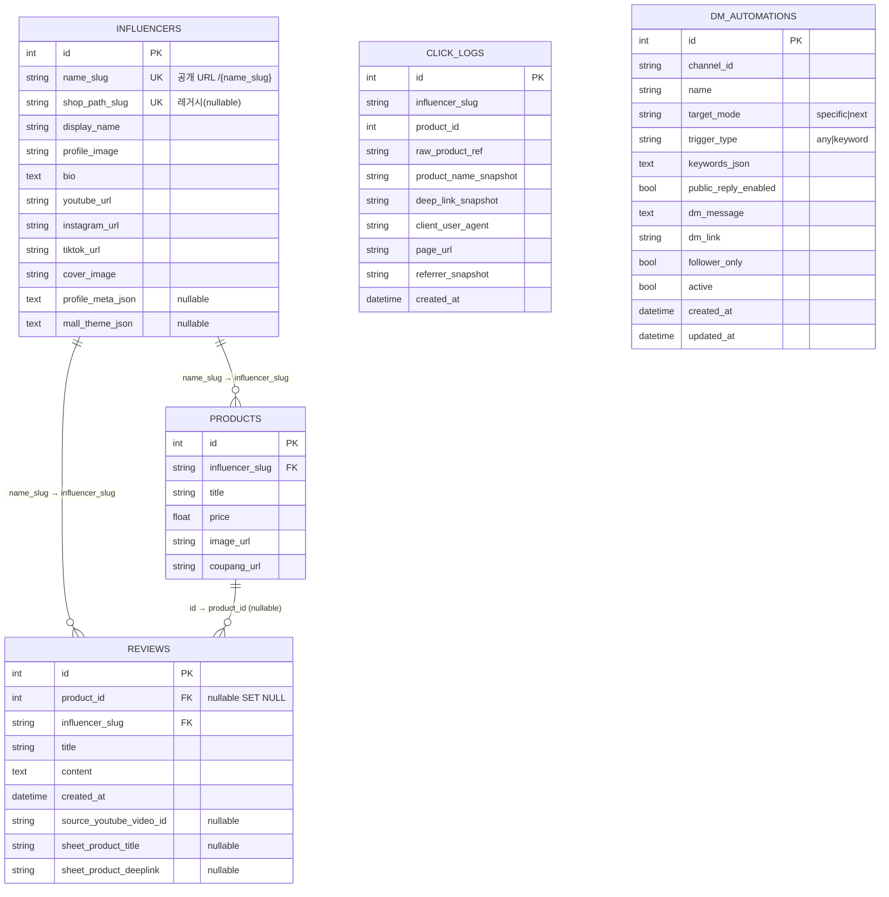

# 데이터베이스 설계서

> shortcrew 데이터 구조. (근거: `models.py`)
> 엔진: SQLAlchemy 2.0 + SQLite, `DATABASE_URL` env 가변(기본 `sqlite:///./database.db`).

## ERD

> short-mall과 동일 스키마 골격이나 **`pumps`→`influencers`**, **`pump_slug`→`influencer_slug`**, 인플루언서에 **`profile_meta_json`** 추가, `mall_theme_json`이 nullable.

## 테이블 정의

### influencers — 인플루언서 마스터

| 컬럼 | 타입 | 제약 | 설명 |
|------|------|------|------|
| id | INTEGER | PK | |
| name_slug | VARCHAR(100) | UNIQUE, INDEX | 공개 URL `/{name_slug}` |
| shop_path_slug | VARCHAR(120) | UNIQUE, NULL | 레거시 경로 매칭 |
| display_name | VARCHAR(200) | - | 표시명 |
| profile_image / cover_image | VARCHAR | "" | 이미지 |
| bio | TEXT | NULL | 소개 |
| youtube_url / instagram_url / tiktok_url | VARCHAR(500) | "" | SNS |
| profile_meta_json | TEXT | NULL | 프로필 메타(JSON) |
| mall_theme_json | TEXT | NULL | 공개몰 테마(JSON) |

### products — 등록 상품

| 컬럼 | 타입 | 제약 | 설명 |
|------|------|------|------|
| id | INTEGER | PK | |
| influencer_slug | VARCHAR(100) | FK→influencers.name_slug (CASCADE), INDEX | 소속 인플루언서 |
| title / price / image_url / coupang_url | - | - | 상품 메타·딥링크 |

> 공개 노출 상품의 진실 소스는 **시트(Apps Script JSON)**, `products`는 백오피스 등록·집계용.

### reviews — 리뷰 (shortcrew 핵심)

| 컬럼 | 타입 | 제약 | 설명 |
|------|------|------|------|
| id | INTEGER | PK | |
| product_id | INTEGER | FK→products.id (SET NULL), NULL | 연결 상품(선택) |
| influencer_slug | VARCHAR(100) | FK→influencers.name_slug (CASCADE) | 소속 |
| title / content | VARCHAR / TEXT | - | 제목·본문(마크다운) |
| created_at | DATETIME | - | 생성(UTC) |
| source_youtube_video_id | VARCHAR(32) | NULL | 출처 쇼츠/영상 |
| sheet_product_title / sheet_product_deeplink | VARCHAR | NULL | 시트 상품 메타 |

- 제약: `UNIQUE(influencer_slug, source_youtube_video_id)` — 쇼츠 자동 발행 중복 방지의 핵심.

### click_logs — 클릭 로그
`influencer_slug` 기준, 스냅샷(UA/page_url/referrer) 포함. (short-mall과 동일 구조, 펌프→인플루언서)

### dm_automations — 인스타 댓글→자동 DM 규칙
채널별 규칙(target_mode specific|next, trigger any|keyword, 공개답글 변형, DM 딥링크, follower_only/active). 두-ID 하드닝(`docs/10`) 적용.

## 인덱스 / 관계

| 항목 | 내용 |
|------|------|
| UNIQUE | influencers.name_slug, influencers.shop_path_slug, reviews(influencer_slug, source_youtube_video_id) |
| INDEX | products.influencer_slug, reviews.product_id/influencer_slug, click_logs.influencer_slug/product_id, dm_automations.channel_id |
| FK | products/reviews.influencer_slug → influencers.name_slug (CASCADE), reviews.product_id → products.id (SET NULL) |

## 초기화 / 마이그레이션

- `scripts/setup_sqlite_from_roster.py` — 채널 로스터(golf/tennis/shopping) 기준으로 SQLite 초기 인플루언서 데이터 셋업.
- SQLite 컬럼 보정 함수로 경량 마이그레이션(Alembic 미사용).
