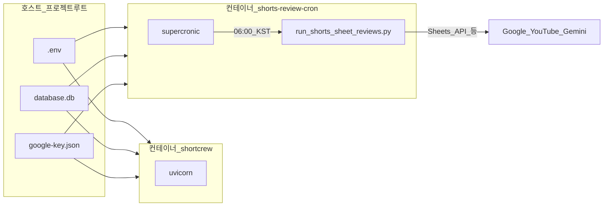

# 쇼츠 리뷰 자동 발행 — 진단 후 조치·수정 방안

[06_SHORTS_SHEET_REVIEWS.md](06_SHORTS_SHEET_REVIEWS.md) 파이프라인이 **기대대로 돌았는지** 확인한 뒤, 아래 순서로 운영·수정하면 된다. 앱 프로세스만 띄워 두면 **스스로 주기 실행되지 않는다**는 점이 전제다 (`scripts/run_shorts_sheet_reviews.py` 또는 어드민 API 호출이 필요).

---

## 1. 진단 완료 후 해야 할 일 (순서)

1. **트리거 존재 여부 확정**  
   - 서버(또는 cron 호스트)에 `run_shorts_sheet_reviews.py`를 **일 1회 이상** 돌리는 cron·systemd timer·외부 스케줄이 **실제로 등록**되어 있는지 확인한다.  
   - Docker만 쓰는 경우 [docker-compose.yml](../docker-compose.yml)의 `shortcrew` 서비스만으로는 **자동 발행이 없음**이 정상이다.

2. **마지막 실행 로그 확인**  
   - cron이면 로그 파일(예: `docs/06` 예시의 `shorts_sheet_reviews.log`) 또는 `journalctl`.  
   - 수동이면 터미널 출력 전체를 보관한다.  
   - 기대 로그: 채널별 `[<ID>] 플랜 기준일…`, `매칭 행 수`, `리뷰 발행 id=…` 또는 스킵 사유 한 줄.

3. **환경 변수·키**  
   - `.env`: `GOOGLE_GEMINI_KEY`, `YOUTUBE_API_KEY`.  
   - 루트 `google-key.json` 및 시트 공유(서비스 계정).  
   - 해당 채널: `CHANNEL_<ID>_SHORTS_AUTOMATION_ENABLED` 가 truthy.

4. **시트 데이터(매칭 조건)**  
   - 기획 탭: 상태 열(기본 C) = `완료`(또는 env 지정값), 날짜 열(기본 D) = **오늘**( `CHANNEL_<ID>_SHORTS_PLAN_DATE_TZ`, 기본 `Asia/Seoul`).  
   - 기획 탭: YouTube 열(기본 W) 유효 URL, 상품명 열(기본 F) 비어 있지 않음.  
   - 몰 상품 탭: 상태(기본 I) = `게시중`, 딥링크 열(기본 G) **필수**.  
   - 기획 F열 상품명 ↔ 몰 탭 C열 상품명이 정규화 후 동등한지(띄어쓰기·표기 차이).

5. **DB 쪽**  
   - `products`에 동일 `influencer_slug`(몰) + 시트와 맞는 상품명 행이 있는지. 없으면 파이프라인이 **상품 미매칭 스킵**한다.  
   - 이미 같은 영상 id로 `reviews`에 있으면 **이미 발행됨**으로 스킵.

6. **재실행 정책**  
   - 시트만 고친 뒤 **같은 날 같은 cron 시각**에 다시 돌리거나, 채널 한정으로 스크립트에 `<ID>` 인자를 붙여 수동 실행한다.  
   - 대량 재처리 방지를 위해 `--limit` 을 쓰는 것은 [scripts/run_shorts_sheet_reviews.py](../scripts/run_shorts_sheet_reviews.py) 주석 참고.

7. **문서·주석 정합성(선택)**  
   - `06` 문서의 cron 예시(예: 06:00 KST)와 스크립트 상단 “자정” 언급이 다를 수 있다. 운영 시각은 **D열이 ‘오늘’로 잡히는 날짜 경계**만 맞으면 되고, 팀 내에서 한 시각으로 통일하면 된다.

---

## 2. 증상별 수정 방안

| 증상 | 원인 후보 | 수정 방안 |
|------|-----------|-----------|
| 아무 로그도 없음 / 스크립트가 안 돎 | cron 미설정, 잘못된 경로·venv | 호스트에 cron/timer 추가; `cd` 경로·`.venv/bin/python` 절대경로 확인 |
| `GOOGLE_GEMINI_KEY 가 없습니다` 등 즉시 종료 | `.env` 누락·cron 환경에 `.env` 미로드 | cron에서 `cd` 후 실행(스크립트가 루트 `.env` 로드) 또는 `set -a; source …` |
| `실행할 채널이 없습니다` | 자동화 플래그 꺼짐 또는 시트 필수값 없음 | `CHANNEL_<ID>_SHORTS_AUTOMATION_ENABLED`, `SHORTS_PLAN_TAB`, `GOOGLE_SHEET_ID` 등 [06](06_SHORTS_SHEET_REVIEWS.md) 표대로 채움 |
| `매칭 행 수(제한 전): 0` | D열 ≠ 오늘, C열 ≠ 완료, URL/상품명 빈칸 | 시트 당일·상태·열 매핑(`SHORTS_COL_*`) 수정 |
| 매칭은 되는데 발행 없음 | 상품 탭 딥링크 없음, 게시중 아님 | 몰 탭에서 G열·I열 정리 |
| `상품 미매칭 스킵` | DB에 상품 없음 또는 이름 불일치 | 어드민/시드로 `products` 추가 또는 시트 상품명 통일 |
| `자막·메타 없음 스킵` | 자막 없는 영상, API/쿼터 | 영상·키 확인; `yt-dlp` 설치 권장([06](06_SHORTS_SHEET_REVIEWS.md)) |
| `Gemini 실패` | 키·쿼터·네트워크 | 키·에러 메시지 확인 |
| `이미 발행됨` | 정상 중복 방지 | 다른 영상이거나 DB에서 의도적 삭제 후에만 재발행 검토 |
| 어드민 API는 되는데 cron만 안 됨 | 인증·경로·환경 분리 | cron 사용자·작업 디렉터리·`google-key.json` 마운트 동일하게 맞춤 |

---

## 3. 구조적 수정 방안 (장기)

운영 부담을 줄이려면 아래 중 하나를 택한다. 코드 변경이 필요하면 별도 작업으로 분리한다.

1. **호스트 cron 유지(권장 변경 최소)**  
   - 현재 설계와 가장 잘 맞음. 실패 시 로그만 보면 됨.

2. **Docker Compose에 전용 서비스**  
   - 예: `cron` 이미지 또는 한 줄 `while sleep 86400; do python …; done` 스타일 워커(정확한 시각이 필요하면 cron 이미지가 낫다).  
   - `database.db`·`google-key.json`·`.env`를 워커에도 동일 마운트.

3. **앱 내 스케줄러**  
   - FastAPI 프로세스에서 APScheduler 등으로 동일 파이프라인 호출.  
   - **다중 인스턴스**면 중복 실행 방지(락·리더 선출) 설계가 필요하고, 웹과 배치가 한 프로세스에 섞인다.

4. **외부 스케줄러**  
   - GitHub Actions, Cloud Scheduler + HTTP(관리자 전용 엔드포인트는 인증·IP 제한 필수) 등.

---

## 4. 관련 코드·문서

| 항목 | 경로 |
|------|------|
| cron용 엔트리포인트 | [scripts/run_shorts_sheet_reviews.py](../scripts/run_shorts_sheet_reviews.py) |
| 채널 설정·오늘 날짜 | [app/admin/ops/services/shorts_review_config.py](../app/admin/ops/services/shorts_review_config.py) |
| 시트 매칭 규칙 | [app/admin/ops/services/shorts_sheet_matcher.py](../app/admin/ops/services/shorts_sheet_matcher.py) |
| 파이프라인·스킵 로그 | [app/admin/ops/services/shorts_review_pipeline.py](../app/admin/ops/services/shorts_review_pipeline.py) |
| DB INSERT | [app/admin/ops/services/review_publish_service.py](../app/admin/ops/services/review_publish_service.py) |
| 어드민 수동 실행 API | [app/admin/ops/routes/shorts_review.py](../app/admin/ops/routes/shorts_review.py) |
| 상세 스펙 | [06_SHORTS_SHEET_REVIEWS.md](06_SHORTS_SHEET_REVIEWS.md) |

---

## 5. `06`과의 역할 분담

- **06**: 시트 스키마, env 키, CLI/API 사용법, cron **예시** 한 줄.  
- **07(본 문서)**: “왜 안 돌았는지” 점검 후 **무엇을 손댈지**, 그리고 **인프라·코드 수준 수정 옵션** 정리.

`06`의 cron 예시를 적용했는지 여부가 곧 **자동 발행 여부**와 직결된다.

---

## 6. 실제 진단에서 나온 할 일 (체크리스트)

아래는 **한 번 돌려본 진단**(로컬/서버: 사용자 crontab 비어 있음, `systemd` 타이머에 해당 작업 없음, 채널 104 드라이런 시 `매칭 행 수(제한 전): 0`)을 기준으로 정리한 **즉시 할 일**이다. 환경마다 다르면 해당 줄만 취하면 된다.

1. **스케줄 등록**  
   - 이 프로젝트 루트에서 `crontab -e` 등으로 [06](06_SHORTS_SHEET_REVIEWS.md)의 `run_shorts_sheet_reviews.py` **cron 예시 한 줄**을 넣는다(절대 경로·`.venv/bin/python`·`TZ=Asia/Seoul` 확인).  
   - Docker만 쓰는 경우에는 호스트 cron이거나, 아래 **7절**처럼 Compose에 `shorts-cron` 프로필을 두는 방식으로 **트리거를 반드시 하나** 둔다.

2. **시트를 오늘 기준으로 매칭되게 맞추기**  
   - 기획 탭: **D열 = 플랜 기준일(기본 KST 오늘)**, **C열 = 완료**(또는 env 지정값), **W·F** 채움.  
   - 몰 상품 탭: **I = 게시중**, **G 딥링크** 필수, **C열 상품명**이 기획 F열과 정규화 후 맞는지 확인.

3. **검증 커맨드**  
   - 프로젝트 루트에서:  
     `.venv/bin/python scripts/run_shorts_sheet_reviews.py --dry-run --limit 3 <채널ID>`  
   - 로그에 `매칭 행 수(제한 전): 0`이면 **시트 조건**을 다시 본다(위 **1. 진단 완료 후…** 항목 4·이 절 2번). 0보다 크면 본 실행 전에 `--limit` 으로 범위를 조절한 뒤 `--dry-run` 없이 실행할지 판단한다.

4. **배포 서버가 다를 때**  
   - 실제 트래픽·DB가 도는 머신에서 위 1~3을 **반복**한다(개발 PC에만 cron이 있어도 프로덕션에는 자동 발행이 안 된다).

---

## 7. Docker Compose로 매일 06:00 KST 실행

**저장소에 반영됨**: [deploy/shorts-review-cron.crontab](../deploy/shorts-review-cron.crontab), [Dockerfile](../Dockerfile)(supercronic + `scripts` 복사), [docker-compose.yml](../docker-compose.yml)의 `shorts-review-cron` 서비스(`profiles: ["shorts-cron"]`). 호스트 `crontab` 없이 `docker compose --profile shorts-cron up -d` 로 동일 스크립트가 매일 돈다.

아래 블록은 **내용 참조용**(실제 파일과 동일하게 유지할 것).

### 7.1 새 파일 `deploy/shorts-review-cron.crontab`

```cron
# 매일 06:00 (컨테이너 TZ=Asia/Seoul)
0 6 * * * /usr/local/bin/python /app/scripts/run_shorts_sheet_reviews.py
```

### 7.2 `Dockerfile` 변경 요지

- `pip install` 뒤에 **supercronic** 바이너리 설치( `dpkg --print-architecture` 로 `amd64` / `arm64` 선택, 릴리스 예: `v0.2.33` ).
- `COPY scripts ./scripts` 및 `COPY deploy/shorts-review-cron.crontab ./deploy/shorts-review-cron.crontab` 추가.

### 7.3 `docker-compose.yml`에 서비스 추가 (예시)

`shortcrew` 서비스와 **동일** `build` / `env_file` / `database.db`·`google-key.json` 볼륨을 쓰고, 프로필만 분리한다.

```yaml
  shorts-review-cron:
    build:
      context: .
      dockerfile: Dockerfile
    container_name: shortcrew-shorts-review-cron
    restart: unless-stopped
    profiles: ["shorts-cron"]
    env_file:
      - .env
    environment:
      TZ: Asia/Seoul
    volumes:
      - ./database.db:/app/database.db
      - ./google-key.json:/app/google-key.json:ro
    command: ["/usr/local/bin/supercronic", "/app/deploy/shorts-review-cron.crontab"]
```

### 7.4 실행·주의

- 빌드 후: `docker compose build && docker compose --profile shorts-cron up -d`  
- 로그: `docker compose logs -f shorts-review-cron`  
- **SQLite**: 웹(`shortcrew`)과 cron 컨테이너가 동시에 `database.db` 에 쓰면 가끔 락이 날 수 있다. 트래픽이 크면 호스트 cron으로 스크립트만 분리 실행하는 편이 안전하다.

---

## 8. 실행 방법 (복붙용)

프로젝트 **루트**에서 실행한다. `.env`·`google-key.json`·`database.db` 가 그 루트에 있어야 한다.

| 목적 | 명령 |
|------|------|
| 이미지 갱신 후 기동 | `docker compose build && docker compose --profile shorts-cron up -d` |
| 웹만(기존과 동일) | `docker compose up -d` — **`shorts-cron` 프로필 없으면 cron 컨테이너는 안 뜸** |
| 웹 + 쇼츠 cron 같이 | `docker compose up -d && docker compose --profile shorts-cron up -d` |
| cron 로그만 보기 | `docker compose logs -f shorts-review-cron` |
| cron만 내리기 | `docker compose --profile shorts-cron stop shorts-review-cron` |
| 상태 확인 | `docker compose ps -a` |

**최초 1회**: `docker compose build` 후 `--profile shorts-cron up -d` 를 안 하면 자동 발행 스케줄은 **전혀 돌지 않는다**(의도된 기본값).

---

## 9. 이번에 바뀐 것·동작 정리

### 9.1 끝난 것 vs 아직 당신 몫

| 구분 | 상태 |
|------|------|
| 저장소에 **트리거 경로** 넣기(Dockerfile·compose·crontab·문서) | **끝남** |
| 서버에서 **실제로** `shorts-cron` 프로필로 컨테이너를 띄웠는지 | 배포마다 **직접 확인** |
| 시트가 D열·C열·몰 탭 조건을 만족해 `매칭 행 수 > 0` 이 되는지 | **데이터 작업** — 코드와 무관 |

즉, **“자동 발행이 반드시 된다”**고 말하려면 위 표 아래 두 줄까지 충족해야 한다.

### 9.2 무엇을 바꿨는지 (파일 단위)

- **[Dockerfile](../Dockerfile)**  
  - 이미지 안에 **supercronic**(컨테이너용 cron 러너) 설치.  
  - **`scripts/`** 전체를 이미지에 넣어, 예전처럼 “웹 이미지에 스크립트 없음” 상태를 없앰.  
  - **`deploy/shorts-review-cron.crontab`** 를 이미지 경로 `/app/deploy/…` 로 복사.

- **[deploy/shorts-review-cron.crontab](../deploy/shorts-review-cron.crontab)**  
  - 한 줄 스케줄: **매일 06:00**에 `/usr/local/bin/python /app/scripts/run_shorts_sheet_reviews.py` 실행.

- **[docker-compose.yml](../docker-compose.yml)**  
  - 서비스 **`shorts-review-cron`**: `shortcrew` 과 **같은 이미지**를 빌드하지만 **CMD 대신** `supercronic` 이 crontab을 읽어 주기 실행.  
  - **`profiles: ["shorts-cron"]`** 로 기본 `up` 에는 포함되지 않게 함.  
  - **`TZ=Asia/Seoul`** 로 crontab의 “06:00”이 한국 새벽 6시로 해석됨.  
  - **`env_file: .env`**, **`database.db`·`google-key.json` 볼륨**은 웹과 동일 — 호스트 파일을 그대로 쓴다.

- **문서**  
  - 본 07(실행·정리), [06](06_SHORTS_SHEET_REVIEWS.md)(Compose 한 절).

### 9.3 런타임에 실제로 어떻게 도는지

1. `shorts-review-cron` 컨테이너가 뜨면 **PID 1이 supercronic** 이다.  
2. supercronic이 **`/app/deploy/shorts-review-cron.crontab`** 을 읽고, 스케줄 시각이 되면 **자식 프로세스로** `python …/run_shorts_sheet_reviews.py` 를 한 번 실행한다.  
3. 그 스크립트는 **호스트와 공유된** `./database.db` 에 접속하고, `.env` 의 키·`CHANNEL_*` 로 시트를 읽어 [06](06_SHORTS_SHEET_REVIEWS.md)과 **동일한 파이프라인**(매칭 → 자막 → Gemini → `reviews` INSERT)을 탄다.  
4. 웹 서비스 `shortcrew` 과는 **프로세스가 분리**되어 있고, **같은 SQLite 파일**만 공유한다 — 동시 쓰기가 잦으면 락 이슈가 날 수 있다(7.4·8절).



### 9.4 예전과의 차이 (한 줄)

**예전**: 자동 발행은 **문서의 cron 예시**만 있고, Docker/저장소에는 **스케줄을 돌릴 주체가 없었다**.  
**지금**: **`docker compose --profile shorts-cron`** 으로 선택적으로 **전용 컨테이너가 매일 같은 스크립트를 실행**한다(시트·DB 조건은 여전히 사용자 데이터에 달림).
